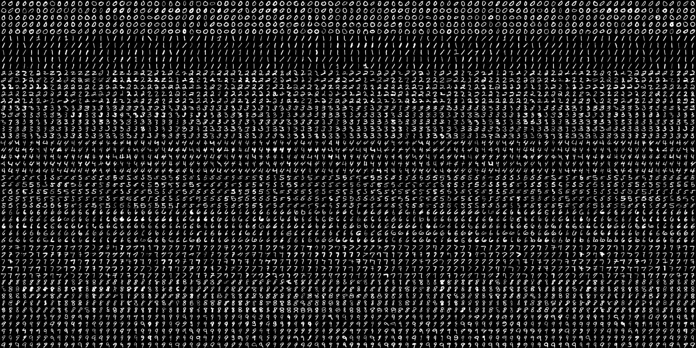
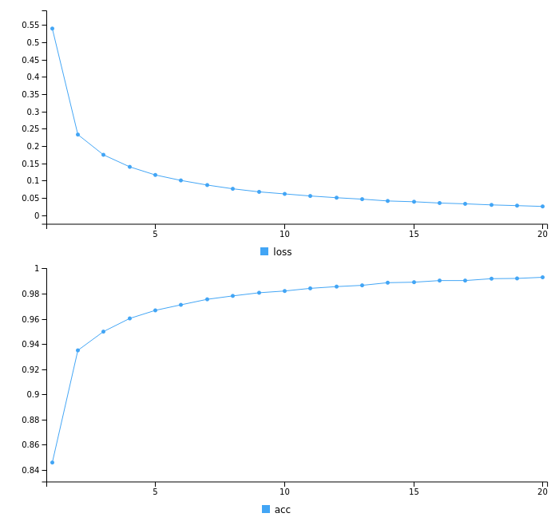
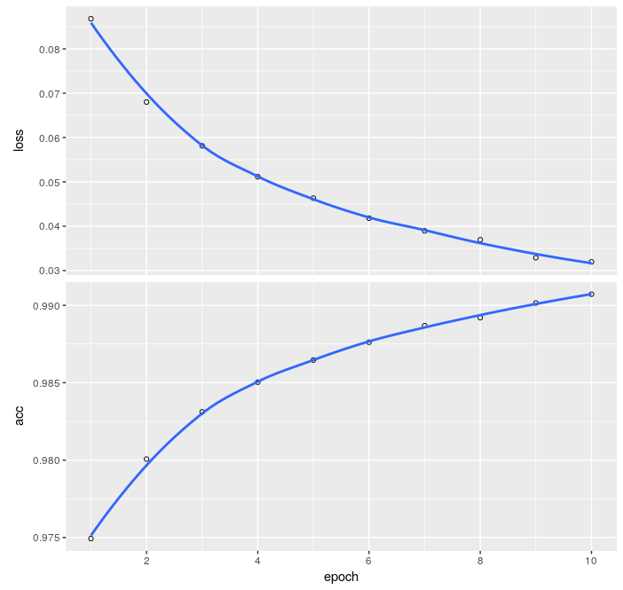

---
title: "Introduction to Deep Learning with R"
author: "Sophie Donnet  for SatRdays"
date: "02/2018"
output: html_document
---   

```{r setup, eval=TRUE,echo=FALSE}
knitr::opts_chunk$set(error = TRUE)
knitr::opts_chunk$set(echo = TRUE)
knitr::opts_chunk$set(eval = FALSE)
suppressMessages(library("tidyverse"))
library(keras)
library(tensorflow)
suppressMessages(library(GGally))
```


# What  are the solutions for Deep Learning in R

The success of deep neural networks has led to a wide range of frameworks and libraries for different programming languages. Examples include Caffee, Theano, Torch and Tensor Flow, among others (see Figure).


### Solutions in R

Many packages, which implement the paradigm of neural networks or link with an existing library in another language. 

Without being exhaustive:

 - `nnet`, the good old multi-layered perceptrons with the nnet package (available in the basic version of R), maintained by the legendary Brian Ripley,
  - `RSNNS` offers an interface with the Stuttgart Neural Network Simulator (SNNS).
  - `FCNN4R` provides an interface with the FCNN library allows user-expandable artificial neural networks,
  - `rnn` implements recurrent neural networks,
  - `deepnet` (feed-forward neural network, restricted Boltzmann machine, deep belief network, stacked autoencoders)
  - `RcppDL`, denoising autoencoder, stacked denoising autoencoder, restricted Boltzmann machine, deep belief network
  - `h2o`, feed-forward neural network, deep autoencoders
  - `DeepNet` has also implemented Deep Neural Networks, Deep Belief Networks and Restricted Boltzmann Machines
  - `mxNet` contains pre-formed templates for object recognition.
  - `kerasR` package, which was written by Taylor Arnold. 
  - `keras` of RStudio is an API (Application programming interface) of high level neural networks developed in order to allow a fast experimentation*


###  About Keras (Python Code)

  - Keras is an open source neural network library written in Python. 
  - Its primary author and maintainer is François Chollet, a Google engineer.
  - Keras supports both convolutional and recurrent networks (as well as combinations of both),
  - Seamlessly runs on CPUs and GPUs
  - Can run on multiple backends, including TensorFlow (https: //tensorflow.rstudio.com/), CNTK and Theano.


### About  the `keras` R package

`keras` R package  allows you to enjoy the benefit of R programming while having access to the capabilities of the Python Keras package 


Here are  some vital links on the subject:

  - The dedicated website: https://keras.rstudio.com/
  - The cheat-sheet of Rstudio on the subject: https://github.com/rstudio/cheatsheets/raw/master/keras.pdf
  - For a great introduction  https://www.datacamp.com/community/tutorials/keras-r-deep-learning
  
  
## Installation
 
- Can be tricky as some of you experimented. 
- Difficulty comes from making Rstudio and Python communicate. 
 
```{r library keras, eval=TRUE, fig.show='asis', fig.keep='all'}
library(keras)
``` 

# Example 1 : MNIST database. 
The MNIST database (modified database of the National Institute of Standards and Technology) is an extensive database of handwritten figures commonly used for the training of various image processing systems. The database is also widely used for training and testing in the field of machine learning. It was created by "remixing" the samples from the original NIST datasets. The creators felt that since the NIST training dataset came from US Census Bureau employees, while the test dataset was from US students, it was not well suited to the experiments of the US Census Bureau. In addition, black-and-white NIST images were normalized to fit in a 28x28-pixel, anti-aliasing bounding box, which introduced grayscale levels.





### Data definition

```{r data mnist, eval=FALSE, fig.show='asis', fig.keep='all'}
#loading the keras inbuilt mnist dataset
data <- dataset_mnist()

#separating train and test file
train_x <- data$train$x
train_y <- data$train$y
test_x <- data$test$x
test_y <- data$test$y
 

# converting a 2D array into a 1D array for feeding into the MLP and normalising the matrix
train_x <- array(train_x, dim = c(dim(train_x)[1], prod(dim(train_x)[-1]))) / 255
test_x <- array(test_x, dim = c(dim(test_x)[1], prod(dim(test_x)[-1]))) / 255

image(matrix(train_x[2,],28,28,byrow=T), axes = FALSE,col=gray.colors(255))

#converting the target variable to once hot encoded vectors using keras inbuilt function
train_y_cat <- to_categorical(train_y,10)
test_y_cat <- to_categorical(test_y,10)
train_y <- train_y_cat
test_y <- test_y_cat
```


### Defining and Learning a neural network with  `keras`

#### R instruction for initialisation 
```{r mnist network  initialisation, eval=FALSE, echo=TRUE }
model <- keras_model_sequential()
```


#### Useful R instructions to write a neural network

  - Dense:  `layer_dense(units = 784, input_shape = 784)`  :  The term dense refers to a layer whose units are completely connected to the previous so-called input layer.

  - Dropout:  `layer_dropout(rate=0.4)` : The term "Dropout" refers to ignored units (whether hidden or visible) in a neural network during the training phase. Ignored units are not considered during a particular forward or backward pass. At each training stage, neurons are therefore removed (or rather ignored) with probability $1-p$
 and are  kept with probability $p$,  so that learning is done on a subnet; incoming and outgoing connections to a deleted neuron are also removed. Dropout is a regularization method that avoids over-learning.


  - Activation: `layer_activation(activation = 'relu')`  There are many activation functions. The simplest and quickest to calculate is the rectified linear: $f(x) = x^+ = max(0,x)$.


#### R instruction to define the network
We are now defining  (with Keras)  the model with 1 input layer[784 neurons], 1 hidden layer[784 neurons] with dropout rate 0.4 and 1 output layer[10 neurons], i.e number of digits from 0 to 9


```{r  mnist networkdefinition, eval =FALSE,echo = TRUE}
model %>% 
layer_dense(units = 784, input_shape = 784) %>% 
layer_dropout(rate = 0.4) %>% 
layer_activation(activation = 'relu') %>% 
layer_dense(units = 10) %>% 
layer_activation(activation = 'softmax')
model %>% compile(
loss = 'categorical_crossentropy',
optimizer = 'adam', 
metrics = c('accuracy')
)
```

**adam** is an adaptive learning rate optimization algorithm that's been designed specifically for training deep neural networks

#### R instruction to learn the network

We   learn the network (i.e. estimate the parameters on the training set) with the following instruction : 


```{r learning echo, eval=FALSE, echo=FALSE}
model <- load_model_hdf5("NN_mnist.h5")
```


```{r learning, eval=FALSE}
learning_history <- model %>% fit(train_x, train_y, epochs = 20, batch_size = 1000)
plot(learning_history)
```




If I think that maybe I can improve the fit by running more epochs, I only have to use the same instruction. The new fit will not start from scratch but from the last initialisation. 

```{r learning again, eval=FALSE, echo=TRUE}
learning_history <- model %>% fit(train_x, train_y, epochs = 10, batch_size = 1000)
```


#### Testing 

We are now ready to test it on the testing set. 
```{r testing, eval = FALSE, echo = TRUE}
predictions <- model %>% predict_classes(test_x)
predictions_proba <- model %>% predict_proba(test_x)
loss_and_metrics <- model %>% evaluate(test_x, test_y, batch_size = 128)
```
The first instructions only predict the classes or probabilities. The second instruction predict and compute the metrics. 

 

#### Output
```{r output, eval=FALSE, echo=TRUE}
summary(model)
```


<!-- #### Saving and loading the keras model  -->

<!-- ```{r saving and loading keras object} -->
<!-- save_model_hdf5(model, "NN_mnist.h5") -->
<!-- model <- load_model_hdf5("NN_mnist.h5") -->
<!-- ``` -->

# Example 2 : convolutional neural network

First we transform the data to fit the format (sample,rows,cols,channels) or (channels,sample,rows,cols). 

```{r  transfo data image}
d <- dim(data$train$x)
train_x_picture <- array(0,c(d,1)) 
train_x_picture[,,,1] <- data$train$x/255
```

We now use the same syntax as before but using the convolutional tools (conv, kernel, pooling, etc...)


```{r  def CNN, eval=FALSE, echo=TRUE}
model_convol <- keras_model_sequential()
model_convol %>%
  layer_conv_2d(filters = 64, kernel_size = c(3,3), use_bias = TRUE, activation = 'relu',data_format = 'channels_last') %>%
  layer_max_pooling_2d(pool_size = c(2, 2)) %>%
  layer_dropout(0.2) %>%
  layer_conv_2d(filters = 32, kernel_size = c(3,3), activation = 'relu') %>%
  layer_flatten() %>%
  layer_dense(units = 10) %>% 
  layer_activation(activation = 'softmax')

model_convol %>% compile(
  loss = 'categorical_crossentropy',
  optimizer = 'adam', 
  metrics = c('accuracy')
)
```

And we learn it. Note that in this case, I chose to remove $10\%$ of the data to evaluate the loss (I will only use $90\%$ remaining data to train): 

... And here comes the drama. If you have a good machine, you will be able to run the following command. If you have a bad machine, then, if you want to do Deep Learning, you will have to but a new one... Do not worry, you can skip this step and go directly to our good old example 'iris'. 


```{r  fit CNN, eval=FALSE, echo=TRUE}
learning_history_convol <- model_convol %>% fit(train_x_picture, train_y, validation_split = 0.1, epochs = 10, batch_size = 1000)
```





#### Output
```{r output CNN, eval=FALSE, echo=TRUE}
summary(model_convol)
```


# Example 3 :  Iris dataset and autoencoder 

## Iris dataset


```{r iris}
data(iris)
x_iris <-
  iris %>%
  select(-Species) %>%
  as.matrix %>%
  scale

y_iris <- to_categorical(as.integer(iris$Species)-1)
```


First, we define a stratified train/test splitting

```{r stratified_train_test_splitting}
set.seed(0)
ntest <- 15 # number of test samples in each class
test.index <-
  tibble(row_number =1:nrow(iris),Species = iris$Species)  %>% group_by(Species) %>% sample_n(ntest) %>% pull(row_number)
train.index <- (1:nrow(iris))[-test.index]

x_iris_train <- x_iris[train.index,]
y_iris_train <- y_iris[train.index,]
x_iris_test <- x_iris[test.index,]
y_iris_test <- y_iris[test.index,]
```


We define a keras model to predict the specie
```{r, eval=FALSE}
model <- keras_model_sequential()
model %>%
layer_dense(units = 4, input_shape = 4) %>%
layer_dropout(rate=0.1)%>%
layer_activation(activation = 'relu') %>%
layer_dense(units = 3) %>%
layer_activation(activation = 'softmax')

model %>% compile(
loss = 'categorical_crossentropy',
optimizer = 'adam',
metrics = c('accuracy')
)
learning_history <- model %>% fit(x_iris_train, y_iris_train, epochs = 200, validation_split=0.0)
loss_and_metrics <- model %>% evaluate(x_iris_test, y_iris_test)

estimation <- apply(predict(model,x_iris_test),1,which.max)
truth <- apply(y_iris_test,1,which.max)
table(estimation, truth)
```

## Auto-encoder
We can also use NN to make an autencoder.


```{r model_for_iris_2_layers, eval = FALSE}
model_autoencoder <- keras_model_sequential()

model_autoencoder %>%
  layer_dense(units = 2, activation = 'linear',input_shape = ncol(x_iris),name = "inter_layer") %>%
 layer_dense(units = 4, activation = 'linear')

model_autoencoder %>% compile(
     loss = 'mse',
     optimizer = 'adam',
     metrics = 'mse'
 )

model_autoencoder %>% fit(
     x_iris_train,
     x_iris_train,
     epochs = 1000,
  batch_size = 16,
  shuffle  = TRUE,
    validation_split = 0.1,
)

model_projection = keras_model(inputs = model_autoencoder$input, outputs = get_layer(model_autoencoder,"inter_layer")$output)

intermediate_output = predict(model_projection,x_iris_train)


```


```{r, eval = FALSE}
library(FactoMineR)
res.pca <- PCA(x_iris_train, graph = FALSE)

par(mfrow=c(1,2))
plot(intermediate_output[,1],intermediate_output[,2],col = y_iris_train %*% (1:3))
plot(res.pca$ind$coord[,1],res.pca$ind$coord[,2], col = y_iris_train %*% (1:3))

```

####  Saving results

```{r saving_loading, eval=FALSE}
save_model_hdf5(model, "my_model.h5")
model <- load_model_hdf5("my_model.h5")
```


# Some references

https://towardsdatascience.com/pca-vs-autoencoders-1ba08362f450

https://www.datacamp.com/community/tutorials/keras-r-deep-learning

https://www.analyticsvidhya.com/blog/2017/06/getting-started-with-deep-learning-using-keras-in-r/
