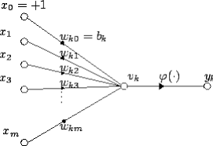
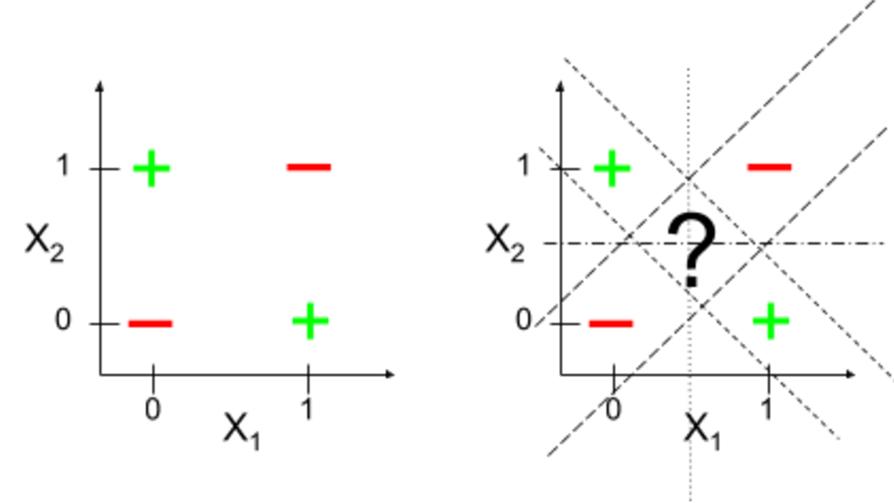
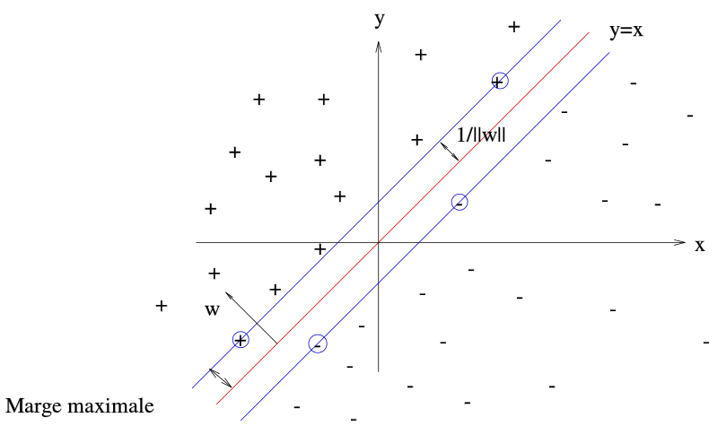
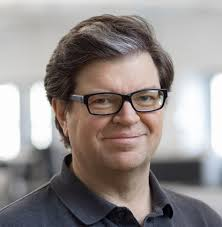
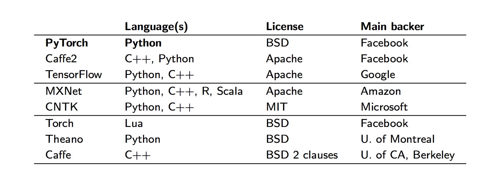

```{r setup, include = FALSE}
knitr::opts_chunk$set(echo = FALSE)
```

## Frise historique

###  {.col-15}


## Les débuts (1940-)

###  L'ordinateur apprenant :  Alan Turing {.box-6  }
- ‘Computing Machinery and Intelligence’ présente le ‘test de Turing’

###   Le neurone artificiel :  W. Pitts and W. McCulloch {.box-6}
- unité logique minimale  
- Warren McCulloch et Walter Pitts propose de créer une machine de  Turing neuronale

### {.col-6 .middle} 



### {.col-3 .bottom }

$$y_k = \varphi \left( \sum_{j=0}^m w_{kj} x_j \right)$$


## Le perceptron de  Frank Rosenblatt (1957)

### {.col-6}
Frank Rosenblatt's Mark I Perceptron at the Cornell Aeronautical Laboratory, Buffalo, New York, circa 1960

### {.col-5}


%end%

> [The perceptron] is the embryo of an electronic computer that [the Navy] expects will be able to walk, talk, see, write, reproduce itself and be conscious of its existence. | Rosenblatt { .bg-yellow}


## La mort du perceptron (1969)

> Dans ''Perceptrons: an introduction to computational geometry''
 	  remarquent qu'un séparateur linéaire ne peut 
implémenter le XOR... imparable et mortelle remarque. | Marvin Minsky et Seymour Papert
{.bg-yellow}


### {.col-8 .offset-1}


## Le rétro-propagation du gradient et les réseaux de neurones multi-couches


### Le perceptron multicouches
- **Geoff Hinton** (arrière-arrière-petit-fils de George Bool) termine son doctorat sur les réseaux de neurones en 1978
- En 1986, avec **David Rumelhart** ils publient un article sur les réseaux de neurones avec de nombreuses couches cachées 

%end%

### Problème d'optimisation complexe {.box-4}

- nombreux paramètres
- critère mal défini

%end%

### Descente de gradient par rétropropagation  {.box-8}

- fonction composée à optimiser
- fonction  d'activation de chaque neurone continue et dérivable
- pas fixe

%end%


## La concurrence des années 90

### Les machines à vecteurs de support 
- **1963**, une idée deVladimir N. Vapnik et  Alexey Ya. Chervonenkis
- **1993**, le truc du noyau et un problème d'optimisation décrit  Boser, Guyon et Vapnik

### {.col-8 .offset-1}


## Renaissance (2006 ?)

### Apprentissage profond  (Hinton 2006)
- former un simple modèle non supervisé à 2 couches, 
- geler tous les paramètres, de coller une nouvelle couche sur le dessus et de former uniquement les paramètres de la nouvelle couche.

### {.col-6}



### Succés en traitement d'image {.box-6}
- Réseau convolutif de Y. Lecun  

%end%

> **Deep Learning Hypothesis**: The success of deep learning is largely a success of engineering. | ?? {.bg-yellow .box-15}

## Les acteurs

### {.col-15}


## Quelques liens 

- Cours du collège de France de Y. Lecun https://www.college-de-france.fr/site/yann-lecun/inaugural-lecture-2016-02-04-18h00.htm
- https://beamandrew.github.io/deeplearning/2017/02/23/deep_learning_101_part1.html
- https://www.import.io/post/history-of-deep-learning/


